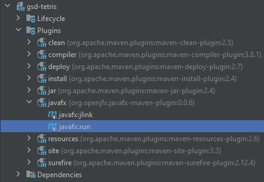
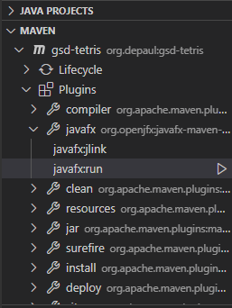
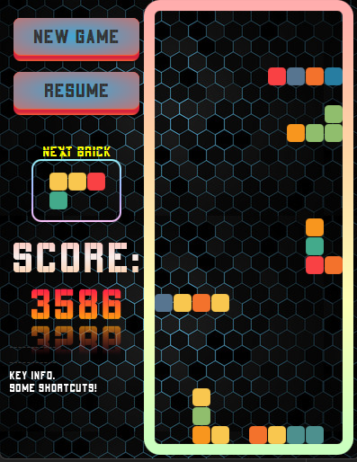

# ATARI-Division - Tetris Game
**Project 3 - SE475 / Global Software Development**

## Run

### Using IDE
You can use Maven plugin and the mvn goal from your IDE (Intellij and VS code). Also, you can directly run
[**Main Merhod**](src/main/java/org/depaul/app/Main.java).

#### Intellij

#### VS Code

### Using Maven

Alternatively, you can run the game by executing the following command in terminal. Make sure you are in the root directory of Tetris application.

`mvn clean javafx:run
`

## Screenshots

## Documentation: Run HelloWorld using Maven

[https://openjfx.io/openjfx-docs/#maven](https://openjfx.io/openjfx-docs/#maven)